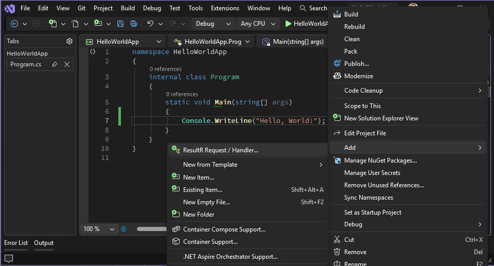

# ResultR VS Toolkit

Supercharge your ResultR development workflow with instant navigation from requests to handlers and one-click scaffolding of new request/handler pairs. The ResultR VS Toolkit is the essential companion extension for developers using the ResultR library.

## Installation

### From Visual Studio Marketplace

1. Open Visual Studio 2022
2. Go to **Extensions** → **Manage Extensions**
3. Search for "ResultR"
4. Click **Download** and restart Visual Studio

### From GitHub Releases

1. Download the `.vsix` file from the [releases page](https://github.com/AlanBarber/ResultR/releases)
2. Double-click to install
3. Restart Visual Studio

## Requirements

- Visual Studio 2022 (17.0 or later)
- Projects using the [ResultR](https://www.nuget.org/packages/ResultR) library

## Features

### Go to Handler Navigation

Instantly navigate from any `IRequest` or `IRequest<T>` type to its corresponding handler implementation.

#### How to Use


1. Place your cursor on any `IRequest` type (variable, parameter, or class definition)
2. Use one of these methods:
   - **Keyboard**: Press `Ctrl+R, Ctrl+H`
   - **Context Menu**: Right-click and select **"Go to Handler..."**

#### What It Finds

The toolkit searches your entire solution for handlers that implement:
- `IRequestHandler<TRequest>` for `IRequest` types
- `IRequestHandler<TRequest, TResponse>` for `IRequest<TResponse>` types

It works across projects, so your handler can be in a completely different assembly.

#### Example


```csharp
// Place cursor on HelloWorldRequest and press Ctrl+R, Ctrl+H
var request = new HelloWorldRequest();
var result = await dispatcher.Dispatch(request);
```

The toolkit will navigate to:

```csharp
public class HelloWorldHandler : IRequestHandler<HelloWorldRequest>
{
    public async ValueTask<Result> HandleAsync(HelloWorldRequest request, CancellationToken cancellationToken)
    {
        // Handler implementation
    }
}
```

### Scaffold Request/Handler Pairs

Quickly create new request and handler classes with proper namespaces and structure.

#### How to Use

1. In **Solution Explorer**, right-click on a project or folder
2. Select **Add** → **ResultR Request / Handler...**
3. Enter the request name (e.g., "HelloWorld")
4. Click **Create**




#### What Gets Generated

The toolkit creates a single `.cs` file containing both the request and handler:

```csharp
using ResultR;

namespace HelloWorldApp
{
    public record HelloWorldRequest() : IRequest;

    public class HelloWorldHandler : IRequestHandler<HelloWorldRequest>
    {
        public async ValueTask<Result> HandleAsync(HelloWorldRequest request, CancellationToken cancellationToken)
        {
            throw new NotImplementedException();
        }
    }
}
```

#### Smart Namespace Detection

The toolkit automatically:
- Detects your project's namespace conventions
- Uses file-scoped namespaces if your project uses them
- Uses block-scoped namespaces if that's your convention
- Places the file in the correct folder with the correct namespace

## Keyboard Shortcuts

| Action | Shortcut |
|--------|----------|
| Go to Handler | `Ctrl+R, Ctrl+H` |

## Troubleshooting

### "No handler found" message

This can happen if:
- The handler doesn't exist yet
- The handler is in a project that isn't loaded
- The handler doesn't implement the correct interface

### Navigation goes to wrong handler

Ensure your handler implements the exact interface for your request type. For example:
- `GetUserRequest : IRequest<User>` should have a handler implementing `IRequestHandler<GetUserRequest, User>`

### Scaffold menu item not visible

The "ResultR Request / Handler..." menu item only appears when you right-click on:
- A C# project
- A folder within a C# project

## Links

- [ResultR on NuGet](https://www.nuget.org/packages/ResultR)
- [ResultR.Validation on NuGet](https://www.nuget.org/packages/ResultR.Validation)
- [VS Marketplace](https://marketplace.visualstudio.com/items?itemName=AlanBarber.ResultR-VSToolkit)
- [GitHub Repository](https://github.com/AlanBarber/ResultR)
- [Report Issues](https://github.com/AlanBarber/ResultR/issues)
